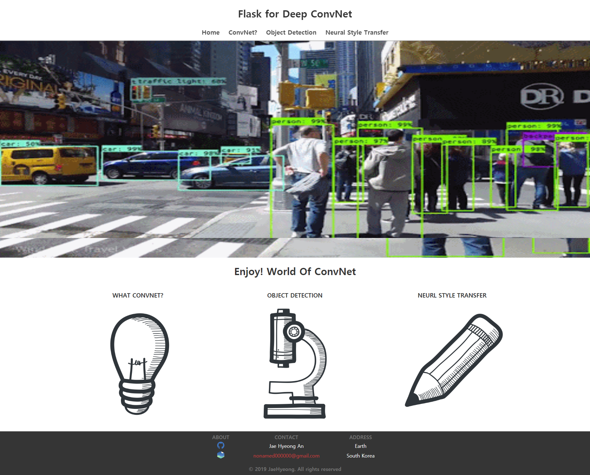
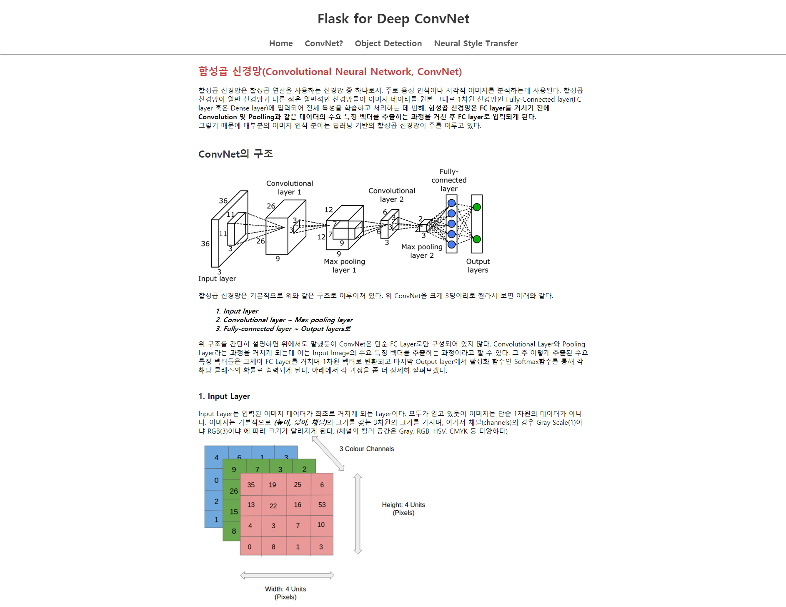
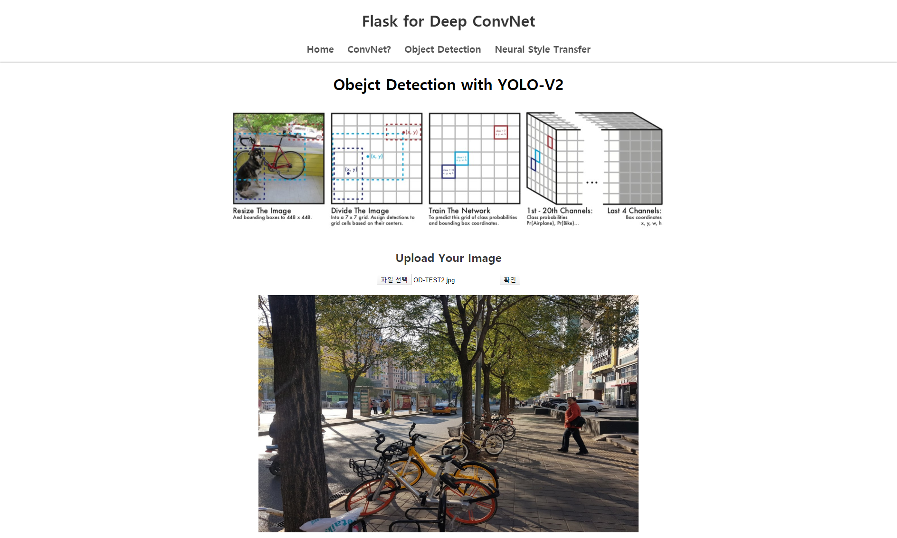
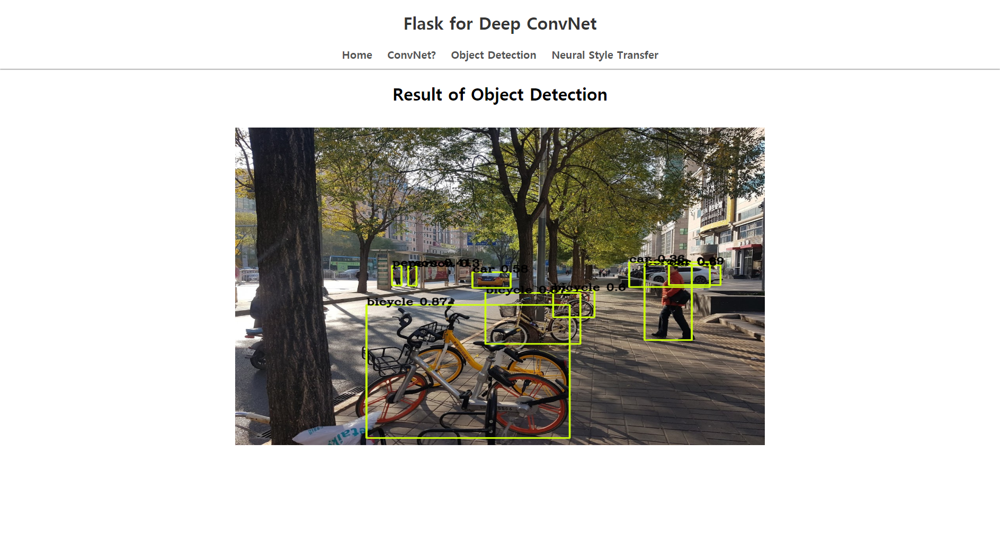
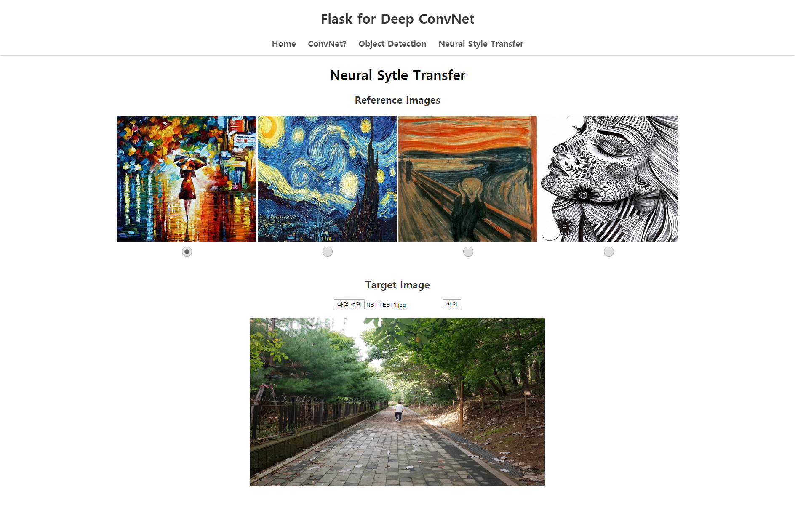
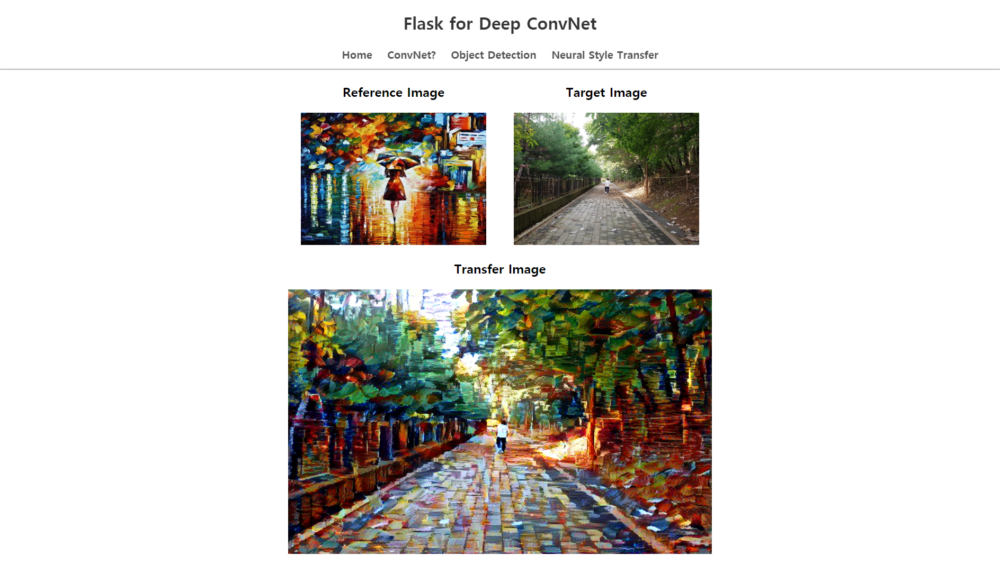

# PyFlask_DL-service
Flask for Computer-Vision Prototype
> Link : ~~[http://54.180.150.154:5000/](http://54.180.150.154:5000/)~~ 
(현재 서버는 내렸습니다!😅)

### Function 
* Object Detection by Darkflow with Fast YOLO-V2
* Neural Style Transfer

### Setting Virtualenv
#### 1. Create virtualenv in Anaconda
```cmd
> conda create -n venv_flask python=3.7
```
#### 2. Activate virtualenv
```cmd
> conda activate venv_flask
```

### Install Requirements
#### 1. Install flask & library
```cmd
(venv_flask) > cd ~pyflask
(venv_flask) ~pyflask > pip install -r requirements.txt
```
* Flask==1.1.1
* pillow==7.0.0
* opencv-python==4.1.2.30
* requests==2.22.0
* tensorflow-gpu==1.15.0
* Keras==2.3.1
* Cython==0.29.14
* darkflow==1.0.0


#### 2. Install Darkflow
```cmd
(venv_flask) ~pyflask > cd .\flask_deep\darkflow_yolo
(venv_flask) ~pyflask\flask_deep\darkflow_yolo > pip install .
```

### Start Server
```cmd
(venv_flask) ~pyflask\flask_deep\darkflow_yolo > cd ../
(venv_flask) ~pyflask\flask_deep > cd ../
(venv_flask) ~pyflask > python start_flask.py
```

<br>

## Main Page


## ConvNet? Page


## Object Detection Page
* Input


* Output


## Neural Style Transfer
* Input


* Output

